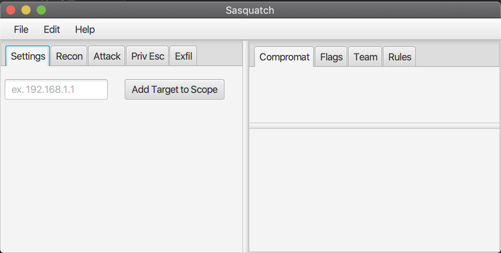

# Sasquatch 
 

A GUI Java application for Capture the Flag competitors

### About 

### Installation 
Sasquatch was developed and tested for Java 13. You can find the latest version of Java on the Oracle Java Download [Site](https://www.java.com/en/download/) . 
+ java 13.0.1 2019-10-15
+ Java(TM) SE Runtime Environment (build 13.0.1+9)
+ Java HotSpot(TM) 64-Bit Server VM (build 13.0.1+9, mixed mode, sharing)

##### Dependencies 
Sasquatch uses the Java FX GUI platform and requires the following Java FX classes.

 + javafx.application.Platform;
 + javafx.event.ActionEvent;
 + javafx.fxml.FXML;
 + javafx.scene.control.Button;
 + kavafx.scene.control.TextField;
 + javafx.scene.input.MouseEvent;

### Features

#### Recon

### Development

#### UI 
Theme Elements were picked from [Color Hunt](https://colorhunt.com/)

### Contributing 
Contributing is welcome, please feel free to fork and pull to add your own features or drop feature requests by submitting an issue. 
