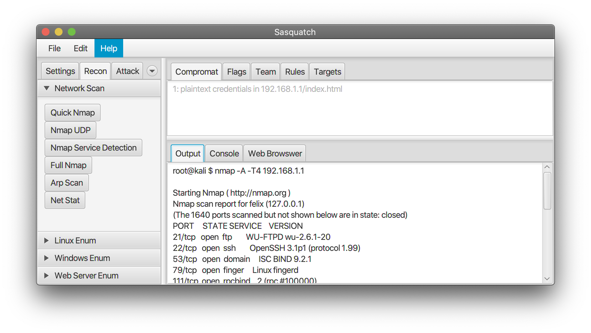

# Sasquatch     

A GUI Java application for Capture the Flag competitors  

### About 
Sasquatch is the first penetration testing tool designed specifically for CTF competitors. It is not a stand-alone application, behind the hood, Sasquatch passes each command as bash arguments to Kali Linux, receives the output and displays and organizes the information. Store important CTF related information like targets, team workspaces, as well as rules and regulations.

### Installation 
Sasquatch was developed and tested for Java 13. You can find the latest version of Java on the Oracle Java Download [Site](https://www.java.com/en/download/) . 
+ java 13.0.1 2019-10-15
+ Java(TM) SE Runtime Environment (build 13.0.1+9)
+ Java HotSpot(TM) 64-Bit Server VM (build 13.0.1+9, mixed mode, sharing)

In order to run in IntelliJ IDEA, you must supply the following run configurations in the vm arguments options feild. 
+ --module-path /Path/to/javafx-sdk-13.0.2/lib/ --add-modules javafx.controls,javafx.fxml

##### Dependencies 
Sasquatch uses the Java FX GUI platform and requires the following Java FX classes.

 + javafx.application.Platform;
 + javafx.event.ActionEvent;
 + javafx.fxml.FXML;
 + javafx.scene.control.Button;
 + kavafx.scene.control.TextField;
 + javafx.scene.input.MouseEvent;

### Features

#### Recon

| Button        | Bash Command           | Description  |
| ------------- |:-------------:|:-------------:|
| Nmap Simple     | $ nmap [targets] --top-ports | Scans the top 100 ports  |
| Nmap UDP       | $ nmap [targets]  -sU    |  UDP Port Scan |
| Nmap Intense  |  $ nmap -sT -sA -A -O -p- [targets]       |    Scan with service version detection |

### Development

#### UI 
Theme Elements were picked from [Color Hunt](https://colorhunt.com/)

### Contributing 
Contributing is welcome, please feel free to fork and pull to add your own features or drop feature requests by submitting an issue. 
